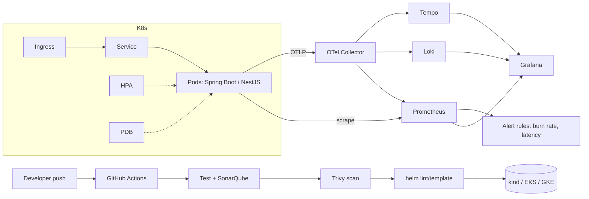

# Architecture

```mermaid
flowchart LR
    Dev[Developer push] --> GH[GitHub Actions]
    GH --> T[Test + SonarQube]
    T --> S[Trivy scan]
    S --> HL[helm lint/template]
    HL --> K[(kind / EKS / GKE)]
    subgraph K8s
      ING[Ingress] --> SVC[Service] --> POD[Pods: Spring Boot / NestJS]
      HPA[HPA] -.-> POD
      PDB[PDB] -.-> POD
    end
    POD -- OTLP --> OC[OTel Collector]
    OC --> TE[Tempo]
    OC --> LO[Loki]
    OC --> PR[Prometheus]
    POD -- scrape --> PR
    PR --> AL[Alert rules: burn rate, latency]
    PR --> GF[Grafana]
    LO --> GF
    TE --> GF
```
