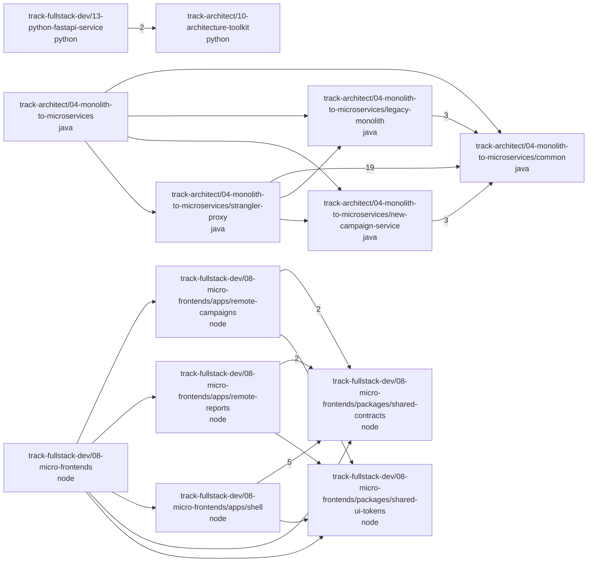

```mermaid
flowchart LR
  p_track_architect_04_monolith_to_microservices["track-architect/04-monolith-to-microservices<br/>java"]
  p_track_architect_04_monolith_to_microservices_common["track-architect/04-monolith-to-microservices/common<br/>java"]
  p_track_architect_04_monolith_to_microservices_legacy_monolith["track-architect/04-monolith-to-microservices/legacy-monolith<br/>java"]
  p_track_architect_04_monolith_to_microservices_new_campaign_service["track-architect/04-monolith-to-microservices/new-campaign-service<br/>java"]
  p_track_architect_04_monolith_to_microservices_strangler_proxy["track-architect/04-monolith-to-microservices/strangler-proxy<br/>java"]
  p_track_architect_10_architecture_toolkit["track-architect/10-architecture-toolkit<br/>python"]
  p_track_fullstack_dev_08_micro_frontends["track-fullstack-dev/08-micro-frontends<br/>node"]
  p_track_fullstack_dev_08_micro_frontends_apps_remote_campaigns["track-fullstack-dev/08-micro-frontends/apps/remote-campaigns<br/>node"]
  p_track_fullstack_dev_08_micro_frontends_apps_remote_reports["track-fullstack-dev/08-micro-frontends/apps/remote-reports<br/>node"]
  p_track_fullstack_dev_08_micro_frontends_apps_shell["track-fullstack-dev/08-micro-frontends/apps/shell<br/>node"]
  p_track_fullstack_dev_08_micro_frontends_packages_shared_contracts["track-fullstack-dev/08-micro-frontends/packages/shared-contracts<br/>node"]
  p_track_fullstack_dev_08_micro_frontends_packages_shared_ui_tokens["track-fullstack-dev/08-micro-frontends/packages/shared-ui-tokens<br/>node"]
  p_track_fullstack_dev_13_python_fastapi_service["track-fullstack-dev/13-python-fastapi-service<br/>python"]
  p_track_architect_04_monolith_to_microservices --> p_track_architect_04_monolith_to_microservices_common
  p_track_architect_04_monolith_to_microservices --> p_track_architect_04_monolith_to_microservices_legacy_monolith
  p_track_architect_04_monolith_to_microservices --> p_track_architect_04_monolith_to_microservices_new_campaign_service
  p_track_architect_04_monolith_to_microservices --> p_track_architect_04_monolith_to_microservices_strangler_proxy
  p_track_architect_04_monolith_to_microservices_legacy_monolith -->|3| p_track_architect_04_monolith_to_microservices_common
  p_track_architect_04_monolith_to_microservices_new_campaign_service -->|3| p_track_architect_04_monolith_to_microservices_common
  p_track_architect_04_monolith_to_microservices_strangler_proxy -->|19| p_track_architect_04_monolith_to_microservices_common
  p_track_architect_04_monolith_to_microservices_strangler_proxy --> p_track_architect_04_monolith_to_microservices_legacy_monolith
  p_track_architect_04_monolith_to_microservices_strangler_proxy --> p_track_architect_04_monolith_to_microservices_new_campaign_service
  p_track_fullstack_dev_08_micro_frontends --> p_track_fullstack_dev_08_micro_frontends_apps_remote_campaigns
  p_track_fullstack_dev_08_micro_frontends --> p_track_fullstack_dev_08_micro_frontends_apps_remote_reports
  p_track_fullstack_dev_08_micro_frontends --> p_track_fullstack_dev_08_micro_frontends_apps_shell
  p_track_fullstack_dev_08_micro_frontends --> p_track_fullstack_dev_08_micro_frontends_packages_shared_contracts
  p_track_fullstack_dev_08_micro_frontends --> p_track_fullstack_dev_08_micro_frontends_packages_shared_ui_tokens
  p_track_fullstack_dev_08_micro_frontends_apps_remote_campaigns -->|2| p_track_fullstack_dev_08_micro_frontends_packages_shared_contracts
  p_track_fullstack_dev_08_micro_frontends_apps_remote_campaigns --> p_track_fullstack_dev_08_micro_frontends_packages_shared_ui_tokens
  p_track_fullstack_dev_08_micro_frontends_apps_remote_reports -->|2| p_track_fullstack_dev_08_micro_frontends_packages_shared_contracts
  p_track_fullstack_dev_08_micro_frontends_apps_remote_reports --> p_track_fullstack_dev_08_micro_frontends_packages_shared_ui_tokens
  p_track_fullstack_dev_08_micro_frontends_apps_shell -->|5| p_track_fullstack_dev_08_micro_frontends_packages_shared_contracts
  p_track_fullstack_dev_08_micro_frontends_apps_shell --> p_track_fullstack_dev_08_micro_frontends_packages_shared_ui_tokens
  p_track_fullstack_dev_13_python_fastapi_service -->|2| p_track_architect_10_architecture_toolkit
```
