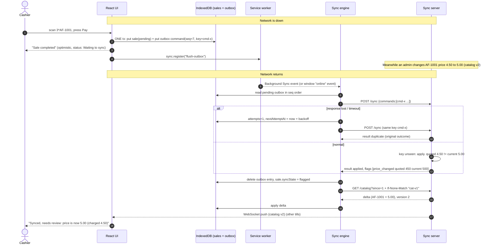

# Sequence: offline sale, reconnect, sync, conflict

```mermaid
sequenceDiagram
  autonumber
  actor C as Cashier
  participant UI as React UI
  participant DB as IndexedDB (sales + outbox)
  participant SW as Service worker
  participant E as Sync engine
  participant S as Sync server

  Note over UI,S: Network is down
  C->>UI: scan 3*AF-1001, press Pay
  UI->>DB: ONE tx: put sale(pending) + put outbox command(seq=7, key=cmd-x)
  UI-->>C: "Sale completed" (optimistic, status: Waiting to sync)
  UI->>SW: sync.register("flush-outbox")
  Note over S: Meanwhile an admin changes AF-1001 price 4.50 to 5.00 (catalog v2)

  Note over UI,S: Network returns
  SW-->>E: Background Sync event (or window "online" event)
  E->>DB: read pending outbox in seq order
  E->>S: POST /sync {commands:[cmd-x ...]}
  alt response lost / timeout
    E->>DB: attempts+1, nextAttemptAt = now + backoff
    E->>S: POST /sync (same key cmd-x)
    S-->>E: result duplicate (original outcome)
  else normal
    S->>S: key unseen: apply. quoted 4.50 != current 5.00
    S-->>E: result applied, flags [price_changed quoted 450 current 500]
  end
  E->>DB: delete outbox entry, sale.syncState = flagged
  E->>S: GET /catalog?since=1 + If-None-Match "cat-v1"
  S-->>E: delta (AF-1001 = 5.00), version 2
  E->>DB: apply delta
  S-->>UI: WebSocket push {catalog v2} (other tills)
  UI-->>C: "Synced, needs review: price is now 5.00 (charged 4.50)"
```
